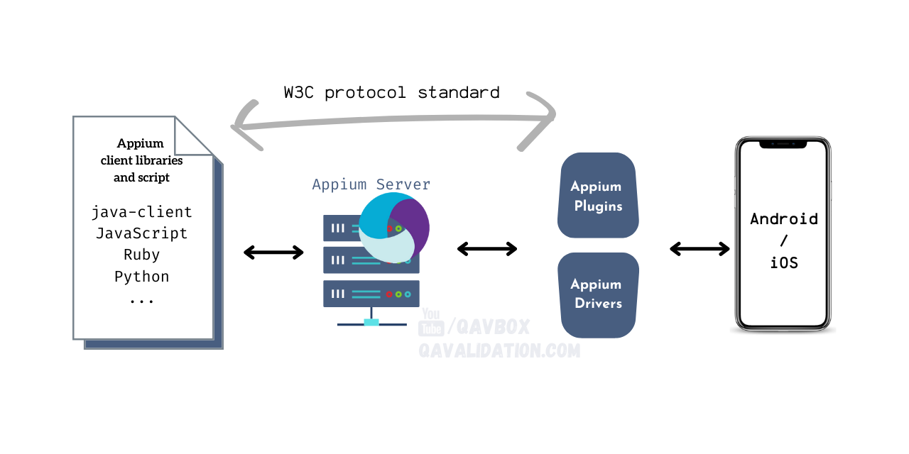

# appium-java-mobile-automation
A test automation framework for android and iOS mobile automation with appium in java

# Appium 2.0 Architecture


# Prerequisites
Node.js should be installed
```bash
brew install node
```

# Install Appium CLI
```bash
npm install appium-installer -g
appium-installer
```

# Start Appium Server
```bash
appium
```

# Appium Drivers
```bash
appium driver install uiautomator2
appium driver install xcuitest
```

# Appium Plugins


# Appium Inspector
- https://github.com/appium/appium-inspector/releases
- https://inspector.appiumpro.com/


# Appium Documentation
- https://appium.io/docs/en/2.0/intro/


# Appium UiAutomator2 Driver Capabilities
- https://github.com/appium/appium-uiautomator2-driver#Capabilities


# Start appium from terminal
```bash
source ~/.bash_profile
appium
```


# Appium Server & Driver Installation
```bash
npm install -g appium@next
appium driver install uiautomator2
appium driver install xcuitest
```

# Resources
- https://github.com/AppiumTestDistribution/appium-device-farm
- https://appium.io/
- https://github.com/appium
- https://github.com/appium/appium-inspector
- https://github.com/appium/appium-desktop
- https://github.com/appium/appium-plugins
- https://github.com/AppiumTestDistribution/appium-wait-plugin
- https://github.com/AppiumTestDistribution/appium-device-farm
- https://github.com/appium/java-client/blob/master/docs/v7-to-v8-migration-guide.md
- https://javadoc.io/doc/io.appium/java-client/latest/deprecated-list.html
- https://mvnrepository.com/artifact/io.appium/java-client
- https://www.jetbrains.com/idea/download
- https://www.youtube.com/watch?v=jQFRgOI8-3o

